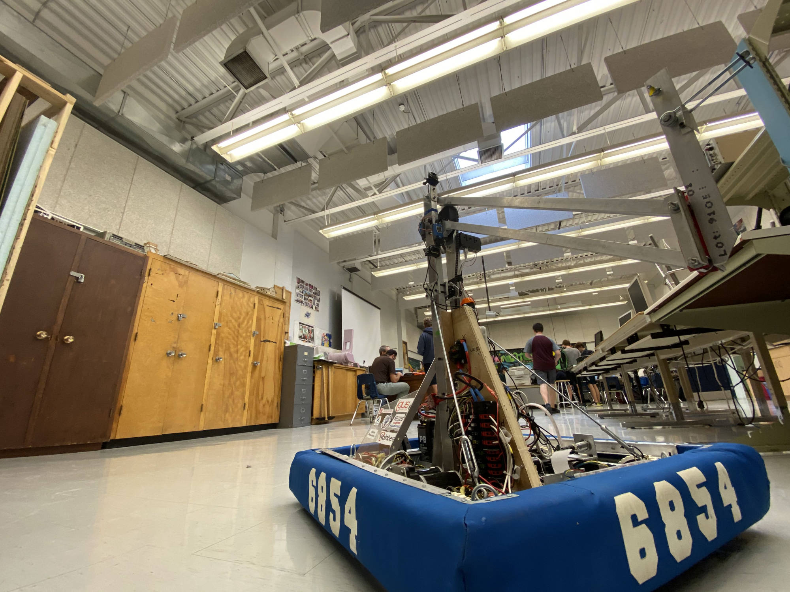

# 2019 Off Season Robot

## Table of Contents

- Overview
- How it is organized
- Building
- Example CommandGroup Template

## Overview



This robot program is for our 2019 Deep Space Competition Robot. It is a very basic and rudimentary bot that uses a simple KOP drivetrain and an arm using a single motor. In this code there are many references to PID Control and the use of the Singleton Pattern. Programmers should have a basic understanding of Java and some FRC programming experience to fully understand this project.

## How it is organized

This project uses a Command Based approach to FRC programming. There are subsystems to every different system on this robot from the drivetrain to the Limelight. In the `team6854` package there is a selection of helpers for OI, LEDs, Limelight and CSV files. The `robot` package holds the robot specific code such as Subsystems, Commands and Auto Command Groups.

## Building

To build this project you should have followed the VS Code basic setup on the FRC Programming website. If you have followed the steps, you should be able to run the WPILib Build command.

## Example CommandGroup Template

Copy and paste this and replace Template to your CommandGroup name.

```java
package frc.robot.command_groups.drivetrain.auto;

import edu.wpi.first.wpilibj.command.CommandGroup;

import frc.robot.commands.arm.*;
import frc.robot.commands.drivetrain.*;
import frc.robot.commands.gyro.*;

import frc.robot.subsystems.Arm;
import frc.robot.subsystems.KitDrivetrain;

import frc.robot.commands.WaitTime;

public class Template extends CommandGroup {

  private KitDrivetrain drivetrain = null;
  private Arm arm = null;

  public Template() {
    drivetrain = KitDrivetrain.getInstance();
    arm = Arm.getInstance();

    requires(drivetrain);
    requires(arm);
  }
}
```
